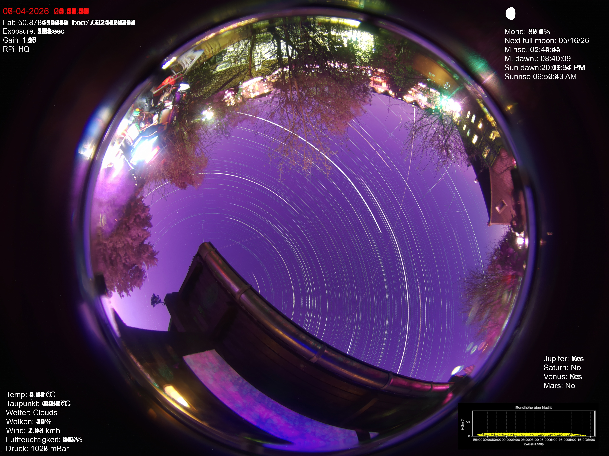

# AllSky to Go STSCI Waldbröl


## how to install

copy all files in the home Directory. 


## Setup crontab

````
crontab -e
````

add this two cronjobs

```
*/30 * * * * python ~/allsky/gps_coords.py
0 */1 * * * /home/raspberry/allsky/scripts/moon_height_venv.sh
```


## install skyfield for moon diagram

```
pip3 install skyfield matplotlib numpy
```

if this not work use a virtual environment
```
sudo apt install python3-venv
mkdir -p ~/allsky/venv
python3 -m venv ~/allsky/venv
source ~/allsky/venv/bin/activate
pip install skyfield requests
```

test the moon_height.py script
```
python ~/allsky/scripts/moon_height.py
```
Change crontab entry. moon_height_venv.sh use For skyfield the new use a virtual enviroment 
```
crontab -e
0 */1 * * * /home/raspberry/allsky/scripts/moon_height_venv.sh

```

if this is not working you can use the quick and dirty Methode

```
pip install skyfield --break-system-packages
```

Now you can overlay this image with your camera Picture. Go to your Webbrowser and to your allsky Webpage. Go to the "Overlay Editor" and Chose "add Existing Image Field". In the image menue you can select moon_height.png.


## install gps
For installing the gps-module I have used the install manuel from Allsky_go
[AllskyGo_GPS_install](https://github.com/Chrise-2000/Allsky_Go/blob/main/C_Installation%20Manual%20v3.0.pdf)
Use a usb-gps-module were you can connect with your pi. IF you don´t want to use a or you haven`t an gps-module enter you coordinates in ~/allskygps_coords.txt

## weather data
For overlay weather data I`ve used the open weather module from allsky-modules. You need only a open-weather apy-key. Registration at https://openweathermap.org/ is free, and data can be accessed up to 3,600 times a day at no additional cost.


## Material
- [RAspberry Pi 5 4 GB RAM](https://www.amazon.de/Raspberry-Pi-SC1111-5-4Gb/dp/B0CK3L9WD3/ref=sr_1_1?__mk_de_DE=%C3%85M%C3%85%C5%BD%C3%95%C3%91&crid=2JU6IEAEQX6AF&dib=eyJ2IjoiMSJ9.oE_1jHVJG4PjSPF4ldhDSL8EzYISIZSWRUZnOjLji3NmT6W-p_gZ8C1NxPwqHOd7w-gkmyWgiPwln_2bJln0gjJc1m9rFwSw7QPO4p_t7GMZzjs2cTt-ZwtfJ-3YafquhXYXXwHYLxT9n56QFMFljS720bDn3vJxntzUrUMSKnEsSuYpwWbKN7dTnWGv_-StTYAUd2lnYEWH6ux78atEPsrIAmOyomx-18V3ggg9oNg.NmGJZythppoLQvRt40qB8iDZaAq5lTSBiqd2SyvAop8&dib_tag=se&keywords=raspberry+pi+5+4+gb&qid=1775920631&sprefix=raspberry+pi+5+4+gb%2Caps%2C127&sr=8-1)
- [Raspberry PI HQ Camera](https://www.amazon.de/dp/B0BHF4D1QY/?coliid=I1J3PC1S74I7JT&colid=3EDH5S17PMNU5&psc=1&ref_=list_c_wl_lv_ov_lig_dp_it)
- [Camera cable](https://www.amazon.de/dp/B0DHVGGY24/?coliid=IGHP5T135L5DJ&colid=3EDH5S17PMNU5&psc=1&ref_=list_c_wl_lv_ov_lig_dp_it)
- [Fisheye M12 1,56 mm](https://botland.de/kameraobjektive-fur-raspberry-pi/17066-fisheye-m12-156-mm-objektiv-mit-adapter-fur-raspberry-pi-kamera-arducam-ln031-5904422378349.html)
- [active cooling](https://www.amazon.de/GeeekPi-Aktiver-Raspberry-Aluminum-K%C3%BChlk%C3%B6rper/dp/B0CNVDF2MC/ref=sr_1_2_sspa?__mk_de_DE=%C3%85M%C3%85%C5%BD%C3%95%C3%91&crid=2JU6IEAEQX6AF&dib=eyJ2IjoiMSJ9.oE_1jHVJG4PjSPF4ldhDSL8EzYISIZSWRUZnOjLji3NmT6W-p_gZ8C1NxPwqHOd7w-gkmyWgiPwln_2bJln0gjJc1m9rFwSw7QPO4p_t7GMZzjs2cTt-ZwtfJ-3YafquhXYXXwHYLxT9n56QFMFljS720bDn3vJxntzUrUMSKnEsSuYpwWbKN7dTnWGv_-StTYAUd2lnYEWH6ux78atEPsrIAmOyomx-18V3ggg9oNg.NmGJZythppoLQvRt40qB8iDZaAq5lTSBiqd2SyvAop8&dib_tag=se&keywords=raspberry%2Bpi%2B5%2B4%2Bgb&qid=1775920631&sprefix=raspberry%2Bpi%2B5%2B4%2Bgb%2Caps%2C127&sr=8-2-spons&aref=qlWk71SAM3&sp_csd=d2lkZ2V0TmFtZT1zcF9hdGY&th=1)

or use the POE HAT

- [POE](https://www.amazon.de/Waveshare-HAT-Power-Over-Ethernet/dp/B0CV4MYGMF/ref=sr_1_2_sspa?crid=3RLYH2IP1HF92&dib=eyJ2IjoiMSJ9.fbtOYnpVDJFhsC7lMQMeTTO8c0Ny8nY9oJw8zfKAhCl2W_DpmjZ9vzLL2IvzJnh6ICbHui1Hs6XspK1Z5eOSPrRrTMexmbLnt-aynk0jU--QlsjtY80Aum4O-P3I4fDFo_MytqkHBmHd4XhIHA_sCB6bOCzVU8h_rl-lMBzpRupuHnpC1mOHsQZAn71Fch1_Kr90iMTeThmub4iMfCasw20Kd0f6-8YoqRCdY-5cd4VjuZubuwSGePYHADbPEXSEZSaGDRUPiQIr_mrObzzIFgbcSRNHTTJyzREGGb_pu0c.nYsgff0ol3b5VhlFY2rA_-qs8qDhDa4BllOKqbvX-Zs&dib_tag=se&keywords=poe+hat+pi+5&qid=1775920834&s=ce-de&sprefix=poe+hat+%2Celectronics%2C110&sr=1-2-spons&aref=crUGpI4QqJ&sp_csd=d2lkZ2V0TmFtZT1zcF9hdGY&psc=1)
- [256GB SD card](https://www.amazon.de/dp/B0BFHHKHFK/?coliid=I21WFDI74E4DGO&colid=3EDH5S17PMNU5&ref_=list_c_wl_lv_ov_lig_dp_it&th=1) 32GB is also OK
- [AllSky Dome](https://www.amazon.de/dp/B01MZGX7XY/?coliid=I1A2HMO3UIRV33&colid=3EDH5S17PMNU5&ref_=list_c_wl_lv_ov_lig_dp_it&th=1)
  
## External Links 
External Projects Links were I have used for this project

[Original AllSky](https://github.com/AllskyTeam/allsky)

[AllSky Modules](https://github.com/AllskyTeam/allsky-modules)

[AllSky Go](https://github.com/Chrise-2000/Allsky_Go)

## Images


